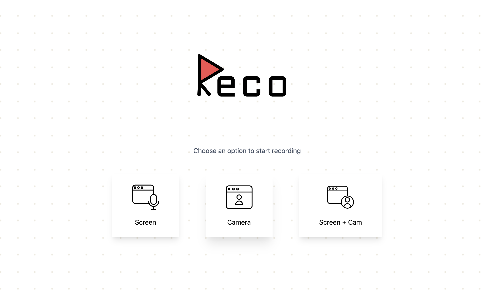

<div align="center">
  <header>
    
    <h1>R E C O</h1>
    <p>In Browser Recording Studio</p>
  </header>
  
</div>


## Contributing

Reco uses `npm` for managing dependencies. [Snowpack](https://www.snowpack.dev/) is used for development and bundling.

Major Dependencies include:

1. [PreactJS](https://preactjs.com/)
1. [HTM](https://github.com/developit/htm)
1. [TailwindCSS](https://tailwindcss.com/)
1. [Framer Motion](https://www.framer.com/motion/)
1. [FFMpegJS](https://github.com/Kagami/ffmpeg.js/)

### How to run

```
npm install
npm start
```

Browser will be running on http://localhost:8080/

### Build application

```
npm install
npm run build
```